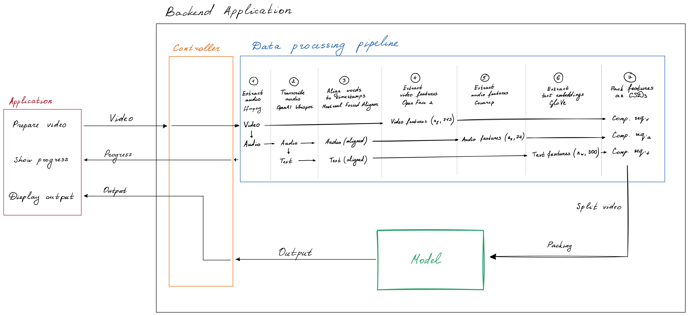

# DMER framework

Download OpenFace 2 executable (FeatureExtraction) for Windows from the
[OpenFace 2 release page](https://github.com/TadasBaltrusaitis/OpenFace/releases/tag/OpenFace_2.2.0)
 or compile from scratch for Linux and put it in the app/pipeline directory.

Then, in the projects root directory:
```sh
conda create -c conda-forge montreal-forced-aligner --prefix aligner
conda activate aligner

python -m venv venv
source ./venv/bin/activate  # Done differently on Windows
python -m pip install -r requirements.txt

mfa server start
mfa model download acoustic english_us_arpa
mfa model download dictionary english_us_arpa

cd app
flask run
```

## Application Architecture

